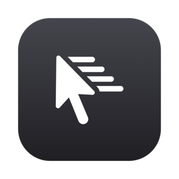

<p align="center">
  
</p>

<h1 align="center">Coast</h1>

<p align="center">
  <b>Trackball-style cursor inertia for macOS trackpads.</b><br>
  Flick and lift — the pointer keeps gliding. Touch the trackpad — it stops dead.
</p>

<p align="center">
  <a href="https://buymeacoffee.com/eastwoodsee"></a>
</p>

---

Coast lives in your menu bar and gives a trackpad the feel of a real trackball. Give the
cursor a flick and it coasts across the screen with momentum, slowing under friction; the
instant you touch the trackpad again it stops exactly where your finger lands. Throw it
again right away and it just works — no pause, no swallowed motion.

## Features

- **Momentum** — a quick flick sends the cursor coasting, decaying smoothly under friction.
- **Instant stop** — touching the trackpad brakes the coast the moment your finger makes
  contact (true finger-contact detection via the private MultitouchSupport framework),
  even if you don't move.
- **Re-flick freely** — throw the cursor again the instant you touch down; nothing is
  delayed or swallowed.
- **Release-speed accurate** — the coast launches at the speed of your flick, not an
  average, so it feels like a real throw.
- **Trackpads only** — coasting requires real finger contact, so mice are never affected.
  A Magic Mouse counts as a mouse, not a trackpad.
- **Menu bar controls** — toggle on/off and tune the feel; settings persist to `~/.coast.json`.
- **Survives sleep/wake** — re-arms its event tap automatically if macOS disables it, so it
  keeps working after your laptop wakes.
- **Native look** — a pure-white template icon in the menu bar, no Dock icon.

## Install

1. Download **`Coast.dmg`** from the [Releases](https://github.com/seastwood/coast/releases)
   page (Apple Silicon; for Intel, build from source below).
2. Open it and drag **Coast** onto **Applications**.
3. First launch — Coast is self-signed (not notarized by Apple), so macOS blocks it once:
   - Double-click **Coast**. When macOS says it *"can't verify it's free of malware,"* click **Done**.
   - Open **System Settings → Privacy & Security**, scroll to the **Security** section, and click
     **Open Anyway** next to the note about Coast, then confirm and authenticate.

   (The old right-click → Open shortcut no longer works on macOS 15+.)
4. Grant permissions in **System Settings → Privacy & Security**:
   - **Accessibility**
   - **Input Monitoring**

   Then quit Coast from the menu bar and relaunch.

The white motion-cursor icon appears in the menu bar.

> **Why two permissions?** Coast watches trackpad movement to measure your flicks (Input
> Monitoring) and moves the cursor to animate the coast (Accessibility). It doesn't log or
> transmit anything — everything stays on your Mac.

## Usage

Click the menu bar icon:

| Menu item | What it does |
| --- | --- |
| **Enabled** | Turn the effect on or off. |
| **Glide** | How far the cursor coasts — friction: Short / Medium / Long. |
| **Flick sensitivity** | How hard you must flick to start a coast: Low / Medium / High. |

Your choices are saved to `~/.coast.json` and restored on launch.

## Build from source

Requires macOS 11+ and Python 3.9+.

```bash
git clone https://github.com/seastwood/coast.git
cd coast

python3 -m venv .venv
.venv/bin/pip install -r requirements.txt

# Run directly during development:
.venv/bin/python main.py
```

### Package a `.dmg`

```bash
# One-time: create a stable self-signed code-signing identity, so macOS keeps your
# Accessibility / Input Monitoring grants across rebuilds instead of resetting them.
./make_cert.sh

# Build Coast.app and package Coast.dmg (app, volume, and file icons applied).
./build_dmg.sh
```

## How it works

- A **`CGEventTap`** watches trackpad movement and estimates your release velocity, timed by
  each event's own hardware timestamp so it stays accurate even when the UI thread is busy.
- The coast is animated by **posting mouse-moved events** from an event source with
  input-suppression disabled, so the cursor is never decoupled from your hand — a returning
  finger takes over instantly.
- **MultitouchSupport** reports finger contact directly, so the coast brakes on touch even
  if the finger doesn't move.
- A small watchdog **re-enables the event tap** whenever macOS disables it (notably across
  sleep/wake).

## Project layout

| File | Purpose |
| --- | --- |
| `main.py` | The whole app — inertia engine plus the menu bar UI. |
| `make_icon.py` | Generates `Coast.icns` from an SF Symbol. |
| `set_icon.py` | Applies an icon to a file or mounted volume (used by the dmg build). |
| `make_cert.sh` | Creates the stable self-signed signing identity. |
| `build_dmg.sh` | Builds `Coast.app` and packages `Coast.dmg`. |

## License

[MIT](LICENSE) © 2026 Seth Eastwood
